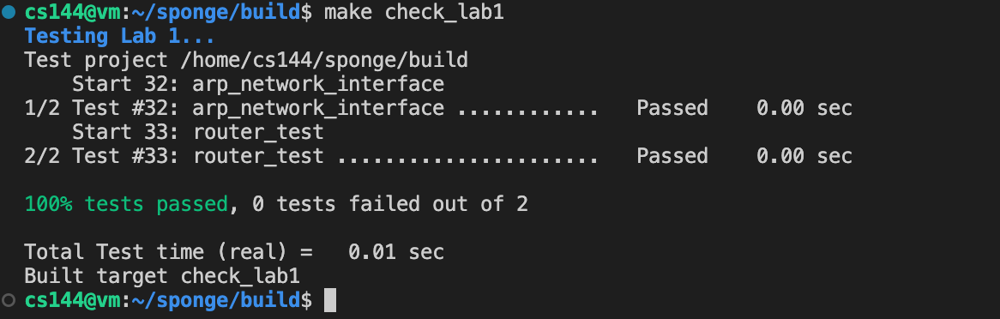

# Lab3 the network interface and IP router

## 一、实验目的：

- 学习掌握网络接口的工作原理
- 学习掌握ARP地址解析协议相关知识
- 学习掌握IP路由的工作原理

## 二、实验内容

- 实现network interface，为每个下一跳地址查找（和缓存）以太网地址，即实现地址解析协议ARP。
- 实现简易路由器，对于给定的数据包，确认发送接口以及下一跳的IP地址。

## 三、主要仪器设备

- 联网的PC机
- Linux虚拟机

## 四、操作方法与实验步骤

(1) 地址解析协议：首先是实现网络接口，即完成ARP地址解析协议的代码编写。文件路径 sponge/libsponge/network_interface.cc。

1. 首先你需要阅读以下内容：
    - NetworkInterface 对象的公共接口。
    - 维基百科对 ARP 的总结以及原始的ARP规范（RFC 826）。
    - EthernetFrame 和 EthernetHeader 对象的文档和实现。
    - IPv4Datagram 和 IPv4Header 对象的文档和实现（这可以解析和序列化一个 Internet 数据报，当序列化时，可以作为以太网帧的有效负载）。、
    - ARPMessage 对象的文档和实现。（它知道如何解析和序列化 ARP 消息，也可以在序列化时作为以太网帧的有效负载）。

2. 实现 `network_interface.cc` 文件中的三个方法：自行在 `.hh` 文件里添加额外的成员变量。
    1. `NetworkInterface::send_datagram()`：当调用方希望向下一跳发送出IP数据包时，将调用此方法将此数据报转换为以太网帧并发送。
    - 如果目标以太网地址已经知道，立即发送。创建一个类型为    `EthernetHeader::TYPE_IPv4` 的以太网帧，将序列化的数据报设置为负载，并设置源地址和目的地址。
    - 如果目的以太网地址未知，则广播请求下一跳的以太网地址，并将IP数据报排队，以便在收到ARP应答后发送。
    2. `NetworkInterface::recv_frame()`：当以太网帧从网络到达时调用此方法，代码应该忽略任何不发送到该网络接口的帧。
    - 如果入站帧是 IPv4，将有效负载解析为 InternetDatagram（调用 `parse()`），如果成功（即，`parse()` 方法返回 `ParseResult::NoError`），将结果 InternetDatagram 返回给调用者。
    - 如果入站帧是 ARP，将负载解析为 ARPMessage。若成功，记住发送者的 IP 地址和以太网地址之间的映射关系 30 秒。另外，如果它是一个请求我们的 IP 地址的 ARP 请求，发送一个适当的 ARP 回复。
    3. `NetworkInterface::tick()`:此方法在到达时间点时调用，终止已过期的IP到Ethernet的映射。

3.  完成代码编写后，你可以运行 `ctest -V -R “^arp”` 命令来进行测试。

（2）实现简易路由: 文件路径sponge/libsponge/root.cc。

1. 首先你需要阅读下面的内容：Router类的文档。
2. 实现 `router.cc` 文件中的两个主要方法：
    1.  `Router::add_route()`：这个方法将路由添加到路由表中，你需要在 Router 类中添加一个数据结构作为私有成员来存储这些信息，保存路由以备以后使用，即需要修改 `.hh` 文件。
    2. `Router::route_one_datagram`：此方法需要将一个数据报从适当的接口路由到下一跳，它需要实现IP路由器的“最长前缀匹配”逻辑，以找到最好的路由。
    3. 提示：
        - 路由器在路由表中查找数据报目的地址匹配的路由，即目的地址的最长 prefix_length 与 route_prefix 的最长 prefix_length 相同。
        - 在匹配的路由中，路由器选择 prefix_length 最长的路由。
        - 如果没有匹配的路由，则丢弃该数据报。
        - 路由器减少数据报的 TTL（存活时间）。如果 TTL 已经为零，**或者在减少之后达到零**，路由器应该丢弃数据报。
        - 否则，路由器将修改后的数据报从接口发送到适当的下一跳（`interface(interface_num).send_datagram()`）。

（3）完成 network interface 和 router 的编写后，运行 make check_lab1 命令来自动测试本次实验所需实现代码的正确性。

## 五、实验数据记录和处理

### 1. 实现network interface，即实现 ARP 协议的关键代码截图

1. 在 `.hh` 中添加额外的成员变量：
    - ARP table, 映射IP地址到以太网地址
    - 定义 ARP 表项，包含以太网地址和上次访问时间
    - 定义 ARP 表超时时间为 30s
    - 定义 ARP 表清理间隔时间为 5s

```cpp
    //! \brief An entry in the ARP table
    struct ARPEntry {
        EthernetAddress ethernet_address;
        size_t last_seen;
    };
    //! ARP table, mapping IP addresses to Ethernet addresses
    map<uint32_t, ARPEntry> _arp_table{};
    //! ARP table timeout in milliseconds
    static constexpr size_t ARP_TIMEOUT_MS = 30 * 1000;
    //! ARP table cleanup interval in milliseconds
    static constexpr size_t ARP_CLEANUP_INTERVAL_MS = 5 * 1000;
    //！ARP awaiting response, some will be cleaned up after a timeout
    // IP address => time when the ARP request was sent
    map<uint32_t, size_t> _waiting_arp_response{};
    //! Ip datagram awaiting response, some will be cleaned up after a timeout
    // IP address => IP datagram
    list<pair<Address, InternetDatagram>> _waiting_ip_response{};
```

2. 补全 `send_datagram()` 方法：
    1. **检查 ARP 表**：
        - 如果 ARP 表中存在下一跳 IP 的 MAC 地址，直接构建以太网帧发送数据报。
        - 如果 ARP 表中没有记录，且没有等待 ARP 回复，构建并发送 ARP 请求，等待获取下一跳的 MAC 地址。
        - 如果已经在等待 ARP 回复，暂存 IP 数据报，等待后续处理。
    2. **处理缓存**：
        - 若发送 ARP 请求时，暂存当前数据报，待收到 ARP 回复后再发送。


```cpp
void NetworkInterface::send_datagram(const InternetDatagram &dgram, const Address &next_hop) {
    // convert IP address of next hop to raw 32-bit representation (used in ARP header)
    const uint32_t next_hop_ip = next_hop.ipv4_numeric();

    // create an ARP request for the next hop IP address
    const auto &arp_iter = _arp_table.find(next_hop_ip);

    // if the next hop IP address is not in the ARP table and we're not already waiting for an ARP response
    if (arp_iter == _arp_table.end() && (_waiting_arp_response.find(next_hop_ip) == _waiting_arp_response.end())) {
        ARPMessage arp_request;
        arp_request.opcode = ARPMessage::OPCODE_REQUEST;
        arp_request.sender_ethernet_address = _ethernet_address;
        arp_request.sender_ip_address = _ip_address.ipv4_numeric();
        arp_request.target_ethernet_address = {};
        arp_request.target_ip_address = next_hop_ip;

        if (DEBUG) {
            cerr << "\033[1;33mDEBUG: Sending ARP request for IP address " << next_hop_ip << "\033[0m\n";
        }

        // serialize the ARP request and create an Ethernet frame
        EthernetFrame frame;
        frame.header().dst = ETHERNET_BROADCAST; //! Ethernet broadcast address (ff:ff:ff:ff:ff:ff)
                                                 // constexpr EthernetAddress ETHERNET_BROADCAST = {0xff, 0xff, 0xff, 0xff, 0xff, 0xff};
        frame.header().src = _ethernet_address;
        frame.header().type = EthernetHeader::TYPE_ARP;
        frame.payload() = arp_request.serialize();

        // push the Ethernet frame onto the outbound queue
        _frames_out.push(frame);

        // remember that we're waiting for an ARP reply
        _waiting_arp_response[next_hop_ip] = 0;

        // remember the IP datagram we're waiting to send
        _waiting_ip_response.push_back({next_hop, dgram});
    } else if (arp_iter == _arp_table.end() && (_waiting_arp_response.find(next_hop_ip) != _waiting_arp_response.end())) { // if the next hop IP address is not in the ARP table but we're already waiting for an ARP response
        // remember the IP datagram we're waiting to send
        _waiting_ip_response.push_back({next_hop, dgram});
    } else { // if the next hop IP address is in the ARP table
        // create an Ethernet frame with the known Ethernet address
        EthernetFrame frame;
        frame.header().src = _ethernet_address;
        frame.header().dst = arp_iter->second.ethernet_address;
        frame.header().type = EthernetHeader::TYPE_IPv4;
        frame.payload() = dgram.serialize();

        // push the Ethernet frame onto the outbound queue
        _frames_out.push(frame);
    }
}
```

2. 补全 `recv_frame()` 方法：
    这段代码的功能是处理接收到的以太网帧 (`recv_frame` 方法)，根据帧的类型和内容做相应处理。
1. **帧过滤**：
   - 检查以太网帧的目标地址 (`dst`) 是否是本机地址或广播地址。如果不是，直接丢弃，返回空值。
2. **处理 ARP 报文**：
   - 如果帧类型为 ARP：
     - 解析 ARP 消息，并提取发送方和目标方的 IP 和 MAC 地址。
     - 检查 ARP 报文是否为：
       - **ARP 请求**：目标 IP 是本机 IP，操作码为 `REQUEST`。
       - **ARP 回复**：目标 MAC 是本机 MAC，操作码为 `REPLY`。
     - 如果是 ARP 请求：
       - 构建并发送 ARP 回复，包含本机的 IP 和 MAC 地址。
     - 如果是 ARP 请求或回复：
       - 更新 ARP 表，将发送方 IP 和 MAC 地址映射记录下来。
       - 检查是否有等待发送的 IP 数据报（之前因未知 MAC 地址而缓存），如果有，取出并发送。
       - 从等待 ARP 回复的列表中删除对应的 IP 地址。
3. **处理 IPv4 数据报**：
   - 如果帧类型为 IPv4：
     - 解析 IPv4 数据报，如果解析成功，返回该数据报。
     - 如果解析失败，返回空值。

```cpp
optional<InternetDatagram> NetworkInterface::recv_frame(const EthernetFrame &frame) {
    // DUMMY_CODE(frame);
    // filter out frames not addressed to us
    if (frame.header().dst != _ethernet_address && frame.header().dst != ETHERNET_BROADCAST) {
        if (DEBUG) {
            cerr << "\033[1;33mDEBUG: Frame not addressed to us\033[0m\n";
        }
        return {};
    }

    // handle ARP requests
    if (frame.header().type == EthernetHeader::TYPE_ARP) {
        ARPMessage arp_request;
        arp_request.parse(frame.payload());

        const uint32_t &src_ip_addr = arp_request.sender_ip_address;
        const EthernetAddress &src_eth_addr = arp_request.sender_ethernet_address;
        const uint32_t &target_ip_addr = arp_request.target_ip_address;
        const EthernetAddress &target_eth_addr = arp_request.target_ethernet_address;

        bool ValidRequest = (target_ip_addr == _ip_address.ipv4_numeric()) && (arp_request.opcode == ARPMessage::OPCODE_REQUEST);
        bool ValidResponese = (target_eth_addr == _ethernet_address) && (arp_request.opcode == ARPMessage::OPCODE_REPLY);

        if (ValidRequest) {
            ARPMessage arp_reply;
            arp_reply.opcode = ARPMessage::OPCODE_REPLY;
            arp_reply.sender_ethernet_address = _ethernet_address;
            arp_reply.sender_ip_address = _ip_address.ipv4_numeric();
            arp_reply.target_ethernet_address = src_eth_addr;
            arp_reply.target_ip_address = src_ip_addr;

            // serialize the ARP reply and create an Ethernet frame
            EthernetFrame eth_frame;
            eth_frame.header().dst = src_eth_addr;
            eth_frame.header().src = _ethernet_address;
            eth_frame.header().type = EthernetHeader::TYPE_ARP;
            eth_frame.payload() = arp_reply.serialize();

            // push the Ethernet frame onto the outbound queue
            _frames_out.push(eth_frame);
        }

        if (ValidRequest || ValidResponese) {
            // update the ARP table
            _arp_table[src_ip_addr] = {src_eth_addr, 0};

            // check if we have any IP datagrams waiting to be sent to this IP address
            for (auto it = _waiting_ip_response.begin(); it != _waiting_ip_response.end();) {
                if (it->first.ipv4_numeric() == src_ip_addr) {
                    send_datagram(it->second, it->first);
                    // remove the IP datagram from the waiting list
                    it = _waiting_ip_response.erase(it);
                } else {
                    ++it;
                }
                // erase the IP datagram from the waiting list
                _waiting_arp_response.erase(src_ip_addr);
            }
        }
    
    }

    // handle IPv4 datagrams
    if (frame.header().type == EthernetHeader::TYPE_IPv4) {
        InternetDatagram dgram;
        if (dgram.parse(frame.payload()) != ParseResult::NoError) {
            return {};
        }
        dgram.parse(frame.payload());
        return dgram;
    }

    return {};
}
```

3. 补全 `tick()` 方法：
    根据上次调用到当前调用的时间间隔 (ms_since_last_tick)，检查并更新超时条目。
    1. **删除超时的 ARP 表项**：
    - 遍历 ARP 表，更新每个条目的 `last_seen` 时间。
    - 如果条目最后一次更新的时间超过了预设的超时时间 (`ARP_TIMEOUT_MS`)，则认为该条目已失效，从 ARP 表中删除。

    2. **检查超时的 ARP 请求并重发**：
    - 遍历等待 ARP 回复的请求列表 (`_waiting_arp_response`)。
    - 对于每个请求，增加等待时间计数器。
    - 如果等待时间超过了预设的重发间隔 (`ARP_CLEANUP_INTERVAL_MS`)，则重发 ARP 请求：
        - 构建一个新的 ARP 请求消息，并封装为以太网帧广播发送。
        - 将等待时间重置为 0，以便下一次继续等待回复。

```cpp
//! \param[in] ms_since_last_tick the number of milliseconds since the last call to this method
void NetworkInterface::tick(const size_t ms_since_last_tick) {
    // DUMMY_CODE(ms_since_last_tick);
    // delete ARP entries that have timed out
    for (auto it = _arp_table.begin(); it != _arp_table.end();) {
        it->second.last_seen += ms_since_last_tick;
        if (it->second.last_seen >= ARP_TIMEOUT_MS) {
            it = _arp_table.erase(it);
        } else {
            ++it;
        }
    }

    // delete ARP requests that have timed out
    for (auto it = _waiting_arp_response.begin(); it != _waiting_arp_response.end();) {
        it->second += ms_since_last_tick;
        if (it->second >= ARP_CLEANUP_INTERVAL_MS) {
            // resend the ARP request
            ARPMessage arp_request;
            arp_request.opcode = ARPMessage::OPCODE_REQUEST;
            arp_request.sender_ethernet_address = _ethernet_address;
            arp_request.sender_ip_address = _ip_address.ipv4_numeric();
            arp_request.target_ethernet_address = {};
            arp_request.target_ip_address = it->first;

            // serialize the ARP request and create an Ethernet frame
            EthernetFrame eth_frame;
            eth_frame.header().dst = ETHERNET_BROADCAST;
            eth_frame.header().src = _ethernet_address;
            eth_frame.header().type = EthernetHeader::TYPE_ARP;
            eth_frame.payload() = arp_request.serialize();

            // push the Ethernet frame onto the outbound queue
            _frames_out.push(eth_frame);
            it->second = 0;
        } else {
            ++it;
        }
    }
}
```

### 测试ARP协议的运行截图


### 实现简易路由的关键代码截图

1. 在 `router.hh` 文件中，添加一个 Router Vector，用于存储路由表的信息。

```cpp
    struct RouterEntry {
        uint32_t route_prefix;
        uint8_t prefix_length;
        std::optional<Address> next_hop;
        size_t interface_num;
    };
    vector<RouterEntry> _router_table{};
```

2. 在 `router.cc` 文件中，实现 `add_route()` 方法，用于添加路由表信息。

```diff
void Router::add_route(const uint32_t route_prefix,
                       const uint8_t prefix_length,
                       const optional<Address> next_hop,
                       const size_t interface_num) {
    cerr << "DEBUG: adding route " << Address::from_ipv4_numeric(route_prefix).ip() << "/" << int(prefix_length)
         << " => " << (next_hop.has_value() ? next_hop->ip() : "(direct)") << " on interface " << interface_num << "\n";

-    DUMMY_CODE(route_prefix, prefix_length, next_hop, interface_num);
+    _router_table.push_back({route_prefix, prefix_length, next_hop, interface_num});
}
```

3. 在 `router.cc` 文件中，实现 `route_one_datagram()` 方法，用于路由数据报。
    1. **提取目的 IP 地址**：
    - 从数据报头部提取目的 IP 地址 `dst`，用于在路由表中匹配。
    2. **检查 TTL 值**：
    - 若数据报的 TTL（Time To Live）为 0，或者在处理过程中 TTL 减为 0，说明数据报已到达寿命限制，需要丢弃，直接返回。
    - 防止数据报在网络中无限循环。
    3. **查找路由表，匹配最长前缀**：
    - 遍历路由表 `_router_table` 中的所有条目，寻找与目的 IP 地址匹配的最佳条目（最长前缀匹配原则）。
    - 通过前缀长度构建掩码，将目的 IP 地址与路由前缀进行比较，找到匹配的条目。
    - 记录匹配程度最高（前缀长度最长）的条目。
    4. **转发数据报**：
    - 如果找到了匹配的路由表条目：
        - 如果条目包含 `next_hop`，则将数据报发送到指定的下一跳地址。
        - 如果没有指定 `next_hop`，则直接发送到数据报的目的 IP 地址。
    - 通过 `interface()` 方法选择相应的网络接口来发送数据报。

```cpp
//! \param[in] dgram The datagram to be routed
void Router::route_one_datagram(InternetDatagram &dgram) {
    // DUMMY_CODE(dgram);
    const uint32_t dest = dgram.header().dst;

    // first check if the ttl is 0
    if (dgram.header().ttl == 0 || --dgram.header().ttl == 0) {
        return;
    }

    // then check if the destination is in the router table
    auto max_matched_entry = _router_table.end();
    for (auto it = _router_table.begin(); it != _router_table.end(); ++it) {
        // invalid prefix length
        if (it->prefix_length > 32) {
            continue;
        }
        // mask is the prefix_length high-order bits of the route_prefix
        uint32_t mask = it->prefix_length == 0 ? 0 : (0xFFFFFFFF << (32 - it->prefix_length));
        if ((dest & mask) == (it->route_prefix & mask)) {
            if (max_matched_entry == _router_table.end() || it->prefix_length > max_matched_entry->prefix_length) {
                max_matched_entry = it;
            }
        }
    }

    // send the datagram
    if (max_matched_entry != _router_table.end()) {
        // if the next hop is not empty, send the datagram to the next hop
        if (max_matched_entry->next_hop.has_value()) {
            interface(max_matched_entry->interface_num).send_datagram(dgram, max_matched_entry->next_hop.value());
        } else {
            interface(max_matched_entry->interface_num).send_datagram(dgram, Address::from_ipv4_numeric(dest));
        }
    }
}
```

### 运行 `make check_lab1` 命令的测试结果展示



## 六、实验数据记录和处理

**1. 通过代码，请描述 network interface 是如何发送一个以太网帧的？**

`network_interface.cc` 中的 `send_datagram()` 方法负责发送以太网帧。其流程如下：

- **检查 ARP 表**：首先查询 ARP 表，确定是否已经存在目标 IP 地址对应的 MAC 地址。
  - **ARP 表中有记录**：如果 ARP 表中存在目标 IP 的 MAC 地址，构建一个包含 IPv4 数据报的以太网帧。帧头包含源 MAC 地址、目标 MAC 地址（从 ARP 表中获取）和类型字段（`TYPE_IPv4`），然后将序列化的 IPv4 数据报作为帧的有效载荷，最后将该以太网帧推入 `_frames_out` 队列，等待发送。
  - **ARP 表中无记录**：如果 ARP 表中没有记录目标 IP 对应的 MAC 地址，则构建并发送一个 ARP 请求，广播以获取目标 MAC 地址。同时，将待发送的数据报暂存至 `_waiting_ip_response` 队列中，等待 ARP 回复后再发送。
  - **ARP 请求等待中**：如果已经发送了 ARP 请求，但还未收到 ARP 回复，则直接缓存 IP 数据报，不重复发送 ARP 请求，避免网络拥塞。

**2. 虽然在此次实验不需要考虑这种情况，但是当 network interface 发送一个 ARP 请求后如果没收到一个应答该怎么解决？请思考。**

在真实网络环境中，若发送 ARP 请求后未收到应答，可以采取以下策略：

- **重试机制**：可以在超时后重新发送 ARP 请求，但重试次数应有限制（如重试 3 次）。若多次重试后依然未收到回复，可以认为目标主机不可达。
- **返回错误或丢弃数据报**：若超过重试次数仍未收到应答，可以丢弃等待发送的数据报，并向上层应用返回错误（如 `Host Unreachable` 错误），提示目标主机无法访问。
- **缓存失败结果并记录时间**：可以缓存未成功解析的 IP 地址，并记录缓存时间，避免频繁发送请求造成网络拥堵。在一段时间（如 5 分钟）内对同一 IP 地址不再重复发送 ARP 请求。
- **触发上层协议处理**：在 TCP/IP 协议栈中，若 ARP 解析失败，通常会交由上层协议（如 ICMP 协议）处理，可能会发送 `ICMP Destination Unreachable` 报文，通知源主机该目标不可达。

**3. 请描述一下你为了记录路由表所建立的数据结构？为什么？**

在 `router.hh` 中，我使用了一个 `vector<RouterEntry>` 数据结构来记录路由表，其中 `RouterEntry` 包含以下字段：

```cpp
struct RouterEntry {
    uint32_t route_prefix;           // 路由前缀，用于匹配目的 IP 地址
    uint8_t prefix_length;           // 前缀长度，用于确定匹配的范围
    std::optional<Address> next_hop; // 下一跳地址，若为空表示直连路由
    size_t interface_num;            // 出接口编号
};
vector<RouterEntry> _router_table{};
```

**选择 `vector` 而非其他数据结构的原因**：

- **按顺序存储**：路由表中的条目通常数量较少（几十条左右），使用 `vector` 存储和查找效率较高，且顺序存储更符合路由表的实际使用场景。
- **前缀匹配需要遍历**：最长前缀匹配算法要求遍历路由表，`vector` 可以提供较好的遍历性能，尤其是在条目数量较少的情况下，遍历 `vector` 的开销较小。
- **无需频繁插入和删除**：路由表通常在初始化时构建，后续操作主要为查找和匹配，使用 `vector` 不涉及频繁的插入和删除操作，性能较为稳定。


## 七、实验数据记录和处理

### 实验感想

#### 1. **ARP 协议实现的收获**

在实验过程中，对多个 IP 数据报等待发送但目标 MAC 地址未知的情况，我理解到了协议设计中的**异步特性**：发送 ARP 请求后不立即等待响应，而是将数据报暂存，等待收到 ARP 回复再处理。这种设计既可以提升网络通信的效率，又避免了由于同步等待导致的阻塞和延迟。通过 `recv_frame()` 方法处理 ARP 报文时，还让我学会了如何动态更新 ARP 表，并通过缓存管理超时条目，体现了协议中对资源高效利用的要求。

#### 2. **简易路由器的设计体会**

在实现简易路由器的过程中，我意识到了路由选择中“**最长前缀匹配**”算法的重要性。实际编程时，通过遍历路由表并构建掩码匹配目的 IP 地址，我领悟到了这一算法的核心思想。
另外，在代码实现上， ttl 的数据类型是 unsigned，所以需要在减少之前判断 ttl 是否为 0。

#### 3. **编程调试中的思考**

实验中最大的挑战在于 `send_datagram()` 和 `recv_frame()` 方法的实现与调试。尤其是在处理 ARP 请求与回复时，必须考虑多种边界情况：例如同时收到多个 ARP 请求、ARP 表中条目过期、缓存的数据报因迟迟收不到回复而需要重发等。调试过程中，通过添加大量的 `DEBUG` 输出（DEBUG 代码没有放在报告里，在我的代码附件中可以通过宏定义 DEBUG 开关），我逐渐培养了细致分析问题的能力，也认识到了完善日志信息对于排查复杂网络问题的重要性。
