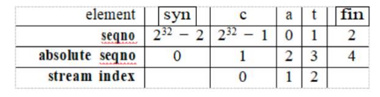
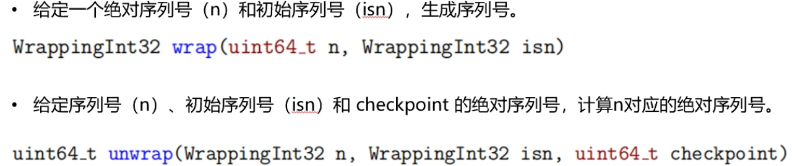
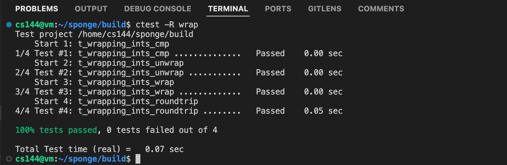
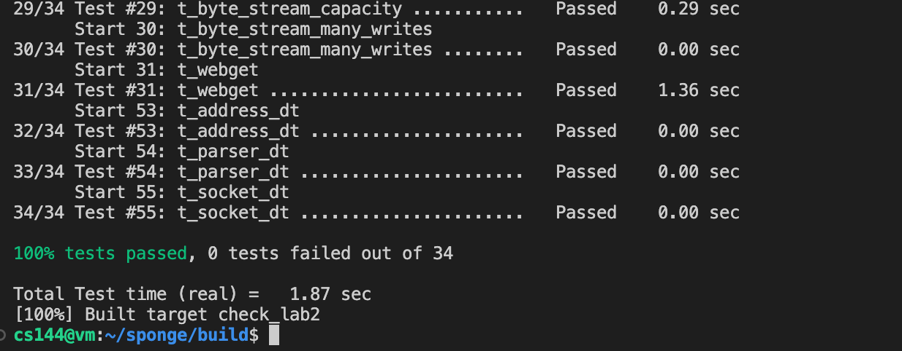

# Lab4 the TCP receiver and the TCP sender

> 3220103784 林子昕

## 一、实验目的：

- 学习掌握 TCP 的工作原理
- 学习掌握流重组器的工作原理
- 学习掌握 TCP receiver 和 TCP sender 的相关知识

## 二、实验内容

- 实现流重组器，一个将字节流的字串或小段按照正确顺序来拼接回连续字节流的模块。
- 实现 TCPReceiver。
    - 接收 TCPsegment；
    - 重新组装字节流；
    - 确定应该发回发送者的信号，以进行数据确认和流量控制。
- 实现 TCPSender：
    - 将 ByteStream 中的数据以 TCP 报文形式持续发送给接收者；
    - 处理 TCPReceiver 传入的 ackno 和 window size，以追踪接收者当前的接收状态，以及检测丢包的情况；
    - 若经过一个超时时间仍然没有接收到 TCPReceiver 发送的 ack 包，则重传。
    - 发送一个空段

## 三、主要仪器设备

- 联网的 PC 机
- Linux 虚拟机

## 四、操作方法与实验步骤

- 理解流重组器 StreamReassembler 接口法：
- 处理索引问题: 在开始实现 receiver 和 sender 前，你需要先处理索引的问题。在流重组器中，每个字节都有一个 64 位的流索引，流中的第一个字节索引总是 0。64 位索引足够大，我可以将其视为不会溢出。然而在 TCP 报头中，流中的每个字节索引不是用 64 位索引表示的，而是用 32 位的序列号表示。这增加了三个复杂性：
    1. 你需要考虑到 32 位的索引的大小问题：通过 TCP 发送的字节流长度往往没有限制 $2^{32}$ 不是很大。一旦 32 位的序列号计数到 $2^{32} - 1$，流中下一个自己的序列号将为 0（容易溢出）。
    2. TCP 序列号从一个随机值开始：TCP 试图确保序列号不会被猜测，也不太可能重复。所以流的序列号不是从零开始的。流中的第一个序列号是一个 32 位的随机数字，称为初始序列号 (ISN)。这是表示 SYN(流的开始)的序列号。其余的序列号在此之后增加: 数据的第一个字节将具有 $ISN+1$ 的序列号 (mod $2^{32}$)，第二个字节将具有 $ISN+2$ (mod $2^{32}$)...
    3. 逻辑开始和结束各自占用一个序列号: 除了确保接收所有数据字节外，TCP 还确保可靠地接收流的开始和结束。因此，在 TCP 中，SYN(流开始)和 FIN(流结束)控制标志也被分配序列号。SYN 标志占用的序列号是 ISN，流中的每个字节数据也占用一个序列号。SYN 和 FIN 不是流本身的一部分，也不是“字节”—它们代表字节流本身的开始和结束。

综上，有三种序列号，tcp 中使用的序列号 seqno（32 位），流重组器 StreamReassembler 中使用的序列号 stream index（64 位），为了二者转换，又引入一种序列号 absolute seqno（64 位）。你可以通过下面这张图来理解：



绝对序列号和流索引之间的转换只需加减 1 即可，但是序列号和绝对序列号之间的转换有点困难，混淆两者可能会产生棘手的错误。为了防止这些错误，我们将用自定义类型 WrappingInt32 表示序列号，并编写它和绝对序列号（用 uint64_t 表示）之间的转换，实现 wrapping_intergers.hh 中提供的方法：



<font color="red">完成代码编写后，在 build 目录运行 `ctest -R wrap` 命令对 WrappingInt32 进行测试。</font>

- 实现 TCPReceiver
在开始实现 receiver 的代码前，请复习 TCPSegment 和 TCPHeader 的文档。你可能对 length_in_sequence_space() 方法感兴趣，该方法计算一个段占用多少序列号（包括 SYN 和 FIN 标志的序列号）。实现 TCPReceiver 接口中的方法，具体实现思路参考 PPT。

- 实现 TCPSender: TCPSender 需将序列号、SYN 标志、有效负载和 FIN 标志组成 segment 发送。然而，TCPSender 在收到 TCPReceiver 发送的 ack 包时只需读取确认号和窗口大小。实现 TCPSender 接口中的方法，具体实现思路见 PPT。注意，在开始代码实现前，这里有一些关于超时重传的描述，请仔细阅读：
    - “时间流逝”：实验中这一概念是通过调用 tick 方法实现的，而不是通过获取实际时间实现的，例如调用 tick(5)，说明过去了 5ms。
    - 超时重传时间 RTO：RTO 值会随着网络环境的变化而变化。当 TCPSender 被构造时，会传入 RTO 的初始值（RTO 保存在 _initial_retransmission_timeout）
    - 重传计时器：和 RTO 比较，判断是否超时
    - 连续重传计数器：记录连续重传次数，过多的重传次数可能意味着网络的中断
        
<font color="red">实现 TCPReceiver 和 TCPSender 后，运行 `make check_lab2` 命令以检查代码的正确性。</font>

- 温馨提示: 当你在开发代码的时候，可能会遇到无法解决的问题，下面给出解决的办法。
    - 运行 `cmake .. -DCMAKE_BUILD_TYPE=RelASan` 命令配置 build 目录，使编译器能够检测内存错误和未定义的行为并给你很好的诊断。
    - 你还可以使用 valgrind 工具。
    - 你也可以运行 `cmake .. -DCMAKE_BUILD_TYPE=Debug` 命令配置并使用 GNU 调试器（gdb）。
    - 你可以运行 `make clean` 和 `cmake .. -DCMAKE_BUILD_TYPE=Release` 命令重置构建系统。
    - 如果你不知道如何修复遇到的问题，你可以运行 `rm -rf build` 命令删除 build 目录，创建一个新的 build 目录并重新运行 `cmake ..` 命令。


## 五、实验数据记录和处理

### 实现 WrappingInt32 的关键代码截图

1. 将 64 位的绝对序列号（absolute sequence number）转换为一个 32 位的环绕整数序列号（WrappingInt32）。

```cpp
WrappingInt32 wrap(uint64_t n, WrappingInt32 isn) {
    WrappingInt32 relative_sequence_number = isn + static_cast<uint32_t>(n);
    return WrappingInt32{relative_sequence_number};
}
```

2. 将一个 32 位的环绕整数序列号（WrappingInt32）转换为一个 64 位的绝对序列号（absolute sequence number）。

```cpp
uint64_t unwrap(WrappingInt32 n, WrappingInt32 isn, uint64_t checkpoint) {
    const constexpr uint64_t INT32_RANGE = 1l << 32;
    // uint32_t offset = static_cast<uint32_t>(n.raw_value() - isn.raw_value());
    uint32_t offset = n - isn;
    uint64_t delta = checkpoint > offset ? checkpoint - offset : 0;
    uint64_t wrap_num = (delta + (INT32_RANGE >> 1)) / INT32_RANGE;
    return wrap_num * INT32_RANGE + offset;
}
```

### 测试 Wrapping 的运行截图



### 实现 TCPReceiver 的关键代码截图

- 在 `tcp_receiver.hh` 中，添加私有成员变量，分别是 isn 序列号和 syn_flag 标志位。

```cpp
WrappingInt32 _isn;
bool _syn_flag;
```

- 在 `tcp_receiver.cc` 中，实现 `TCPReceiver::segment_received` 方法。

    1. 首先判断是否已经接收到 SYN 标志，如果没有则忽略该段。
    2. 获取序列号，通过 unwrap 方法将 32 位的序列号转换为 64 位的绝对序列号。
    3. 获取 payload，将 payload 传递给 reassembler 进行重组。

```cpp
void TCPReceiver::segment_received(const TCPSegment &seg) {
    const TCPHeader &header = seg.header();

    // Handle SYN (synchronize) flag
    if (!_syn_flag) {
        if (!header.syn) {
            return; // Ignore segments before SYN
        }
        _isn = header.seqno;      // Save the initial sequence number (ISN)
        _syn_flag = true;     // Mark SYN as received
    }

    // get seqno
    uint64_t seqno = unwrap(header.seqno, _isn, _reassembler.stream_out().bytes_written());

    // get payload
    uint64_t index = seqno - 1 + header.syn;
    _reassembler.push_substring(seg.payload().copy(), index, header.fin);
}
```

- 在 `tcp_receiver.cc` 中，实现 `TCPReceiver::ackno` 方法。
    1. 如果 SYN 标志未被接收，则没有有效的确认号。
    2. 计算确认号，确认号为已写入的字节数加 1，如果已经接收到 FIN 标志，则再加 1。

```cpp
optional<WrappingInt32> TCPReceiver::ackno() const {
    // If SYN has not been received, there is no valid acknowledgment number
    if (!_syn_flag) {
        return {};
    }

    // Calculate the acknowledgment number
    uint64_t ack_abs = _reassembler.stream_out().bytes_written() + 1;
    if (_reassembler.stream_out().input_ended()) {
        ack_abs += 1; // Include FIN if it has been received
    }
    return wrap(ack_abs, _isn);
}
```

- 在 `tcp_receiver.cc` 中，实现 `TCPReceiver::window_size` 方法。
    1. 计算窗口大小，窗口大小为 reassembler 的未被确认的字节数。

```cpp
size_t TCPReceiver::window_size() const {
    return _capacity - _reassembler.stream_out().buffer_size();
}
```

### 实现 TCPSender 的关键代码截图

- 在 `tcp_sender.hh` 中，添加私有成员变量，分别是初始重传超时时间、最大重传次数、当前重传超时时间、当前重传次数、发送的段、发送的空段。

```cpp
    int _timeout{-1};
    int _timecount{0};

    //! store the segments that have been sent but not yet acknowledged
    std::map<size_t, TCPSegment> _outgoing_map{};
    size_t _outgoing_bytes{0};
    //! store the last window size received from the receiver
    size_t _last_window_size{1};
    //! count of consecutive retransmissions
    size_t _consecutive_retransmissions_count{0};

    //! flags to keep track of the state of the connection
    bool _syn_flag{false};
    bool _fin_flag{false};
```

- 在 `tcp_sender.cc` 中，实现 `TCPSender::fill_window` 方法。
    1. 如果 SYN 标志未被发送，则发送 SYN 标志。
    2. FIN 标志的发送条件：EOF 流为空、FIN 标志未被发送、发送的数据加上 FIN 标志小于窗口大小。
    3. 如果发送的段为空，则退出。在这里指的空的判断不是指 payload 为空，而是指 segment 的长度为 0，的原因在于 **TCP 数据段不仅包括有效载荷（payload），还可能包括控制标志（如 SYN 和 FIN）**。
    4. 计算窗口大小，窗口大小为最小值（发送的段大小、窗口大小、未被确认的字节数）。
    5. 将窗口大小内的数据发送出去。

```cpp
void TCPSender::fill_window() {
    // if the window is 0, regard it as 1, else do nothing
    size_t curr_window_size = (_last_window_size != 0) ? _last_window_size : 1;

    // fill the window with data
    while (_outgoing_bytes < curr_window_size) {
        TCPSegment segment;
        
        // send SYN
        if (!_syn_flag) {
            segment.header().syn = true;
            _syn_flag = true;
        }

        // set the sequence number
        segment.header().seqno = next_seqno();

        // set the payload
        size_t remaining_capacity = curr_window_size - _outgoing_bytes - segment.header().syn;
        size_t max_payload_size = min(TCPConfig::MAX_PAYLOAD_SIZE, remaining_capacity);
        Buffer payload = _stream.read(max_payload_size);

        // send FIN: if the stream is empty and the FIN flag is not set
        // eof equals to input_ended and buffer_empty
        if (_stream.eof() && !_fin_flag && (payload.size() + _outgoing_bytes < curr_window_size)) {
            segment.header().fin = true;
            _fin_flag = true;
        }

        segment.payload() = Buffer(payload);

        // if no data to send, break
        // if (payload.size() == 0) { // BUG CODE, if the payload is empty, the segment is still needed to send
        if (segment.length_in_sequence_space() == 0) {
            break;
        }

        // if no dgram awaiting ack, set timeout
        if (_outgoing_map.empty()) {
            _timeout = _initial_retransmission_timeout;
            _timecount = 0;
        }

        // add the segment to the outgoing map
        _segments_out.push(segment);
        _outgoing_map.insert(make_pair(_next_seqno, segment));
        _outgoing_bytes += segment.length_in_sequence_space();
        _next_seqno += segment.length_in_sequence_space();

        // if FIN is set, break
        if (segment.header().fin) {
            break;
        }
    }

}
```

- 在 `tcp_sender.cc` 中，实现 `TCPSender::ack_received` 方法。
    1. 如果确认号大于下一个序列号，则直接返回。
    2. 获取绝对序列号，遍历发送的段，删除已经被确认的段。
    3. 重置超时时间和连续重传次数。
    4. 更新窗口大小，填充窗口。

```cpp
void TCPSender::ack_received(const WrappingInt32 ackno, const uint16_t window_size) {
    size_t abs_seqno;
    if (unwrap(ackno, _isn, _next_seqno) > _next_seqno) {
        return;
    } else {
        abs_seqno = unwrap(ackno, _isn, _next_seqno);
    }
    
    // traverse the outgoing map to remove the segments that have been acknowledged
    auto it = _outgoing_map.begin();
    while (it != _outgoing_map.end()) {
        const TCPSegment &seg = it->second;
        // if the segment is acknowledged
        if (it->first + seg.length_in_sequence_space() <= abs_seqno) {
            // Remove the segment from the outgoing map
            _outgoing_bytes -= seg.length_in_sequence_space();
            it = _outgoing_map.erase(it);

            // Reset the retransmission timeout
            _timeout = _initial_retransmission_timeout;
            _timecount = 0;
        } else {
            break; // No need to check the rest
        }
    }

    // reset the consecutive retransmissions count
    _consecutive_retransmissions_count = 0;
    // update the last window size and fill the window
    _last_window_size = window_size;
    fill_window();
}
```

- 在 `tcp_sender.cc` 中，实现 `TCPSender::tick` 方法。
    1. 时间流逝，更新时间计数。
    2. 如果窗口大小不为 0，则进行拥塞控制，更新超时时间。
    3. 如果窗口大小为 0，则不进行拥塞控制。
    4. 不论是否进行拥塞控制，都将重置超时时间、连续重传次数加 1，并将未被确认的段发送出去。

```cpp
void TCPSender::tick(const size_t ms_since_last_tick) {
    _timecount += ms_since_last_tick;

    auto it = _outgoing_map.begin();
    if (it != _outgoing_map.end() && _timecount >= _timeout) {
        // congestion control
        _timecount = 0;
        // Special case: if the window size is 0, not congestion control
        _timeout = _last_window_size ? _timeout * 2 : _initial_retransmission_timeout;
        _segments_out.push(it->second);
        _consecutive_retransmissions_count++;
    }
}
```

- 在 `tcp_sender.cc` 中，实现 `TCPSender::send_empty_segment` 方法。
    1. 发送一个空段，序列号为下一个序列号。

```cpp
void TCPSender::send_empty_segment() {
    TCPSegment segment;
    segment.header().seqno = next_seqno();
    _segments_out.push(segment);
}
```

### 运行 `make check_lab2` 命令的测试结果展示



## 六、实验数据记录和处理

### 通过代码，请描述 TCPSender 是如何发送出一个 segment 的？

1. 首先，如果 SYN 标志未被发送，则发送 SYN 标志。
```cpp
if (!_syn_flag) {
    segment.header().syn = true;
    _syn_flag = true;
}
```
2. 设置序列号，序列号为下一个序列号。
```cpp
segment.header().seqno = next_seqno();
```
3. 计算出窗口大小，设置有效载荷，有效载荷为从流中读取的数据。
```cpp
size_t remaining_capacity = curr_window_size - _outgoing_bytes - segment.header().syn;
size_t max_payload_size = min(TCPConfig::MAX_PAYLOAD_SIZE, remaining_capacity);
Buffer payload = _stream.read(max_payload_size);
segment.payload() = Buffer(payload);
```
4. FIN 发送的三个条件：EOF 流为空、FIN 标志未被发送、发送的数据加上 FIN 标志小于窗口大小。
```cpp
if (_stream.eof() && !_fin_flag && (payload.size() + _outgoing_bytes < curr_window_size)) {
    segment.header().fin = true;
    _fin_flag = true;
}
```
5. 如果发送的段为空，则退出。(这里的空不是指 payload 为空，而是指 segment 的长度为 0，因为 TCP 数据段不仅包括有效载荷（payload），还可能包括控制标志（如 SYN 和 FIN）);否则，将段加入发送队列，更新发送的字节数，更新下一个序列号。判断退出的条件是：发送的段为空或者发送的段包含 FIN 标志。
```cpp
_segments_out.push(segment);
_outgoing_map.insert(make_pair(_next_seqno, segment));
_outgoing_bytes += segment.length_in_sequence_space();
_next_seqno += segment.length_in_sequence_space();
```

### 请用自己的理解描述一下 TCPSender 超时重传的整个流程。

1. 时间累计：每次 tick 调用会累积时间，检查是否达到超时时间。
2. 超时判断：如果有未确认的段且超时，则触发重传逻辑。
3. 拥塞控制：根据接收窗口大小判断是否进行指数退避：
    - 窗口非零：可能是网络拥塞，进入指数退避，增大超时时间, 恢复初始超时时间。
    - 窗口为零：无需拥塞控制，恢复初始超时时间。
4. 重置计时器：重传后清空 `_timecount`，重新计时。
5. 重传段：将最早未确认的段重新加入发送队列 `_segments_out`。
6. 更新计数器：记录连续重传次数，供后续逻辑参考。

### 请描述一下你为了重传未被确认的段建立的数据结构？为什么？

```cpp
std::map<size_t, TCPSegment> _outgoing_map{};
size_t _outgoing_bytes{0};
```

- `_outgoing_map` 是一个 map，用于存储未被确认的段，key 为序列号，value 为 TCPSegment。
- `_outgoing_bytes` 是一个 size_t 类型的变量，用于记录未被确认的字节数。

使用 std::map<size_t, TCPSegment> 存储已发送但未确认的 TCP 段，以段的起始序列号作为键，段的内容作为值。map 提供了**按序存储**和**高效查找**的特性，特别适合 TCP 发送端这样的场景，需要**按序管理和快速查找未确认的段**。

- 自动按键排序，保证段以序列号递增的顺序存储，符合 TCP 协议中数据段按序传输和确认的需求，键值管理，可以简化未确认段的插入、删除和查询操作，不需要额外维护序列号排序或构建复杂的查找逻辑。
- map 的底层实现是平衡二叉搜索树，提供对任意键的对数时间复杂度查找。在接收到 ACK 时，可以快速查找起始序列号小于等于确认号的段，并将其移除。
- 灵活删除，当某些段被确认时，可以通过键直接删除对应的段，而不需要遍历整个容器。这在处理部分确认或乱序确认的情况下尤其高效。

### 请思考为什么 TCPSender 实现中有一个发送空段的方法，能描述一下你是怎么理解的吗？

即使没有有效载荷，TCP 段依然可以携带控制信息，如序列号、确认号、窗口大小和控制标志（SYN、FIN、ACK），发送空段可以特殊情况下完成状态维护和协议要求：
- 当接收方窗口为零时，通过发送空段探测窗口是否更新
- 在长时间无数据传输时，用于保活连接
- 在握手和挥手过程中，携带 SYN 或 FIN 标志完成控制任务
- 触发接收方发送 ACK，确保发送方与接收方的状态同步

## 七、实验数据记录和处理

助教的实验课讲的原理以及每个函数部分的实现方法和逻辑都非常细致和清晰，伟大
