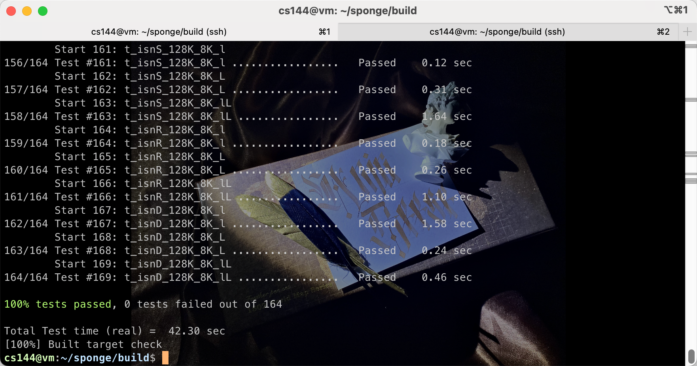
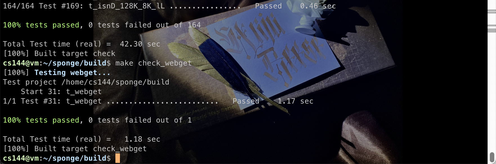
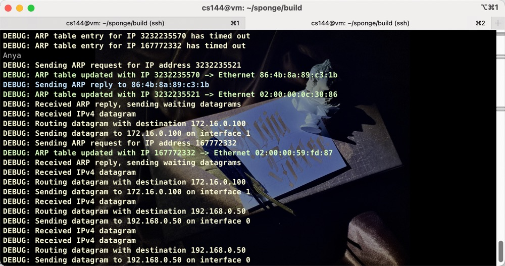
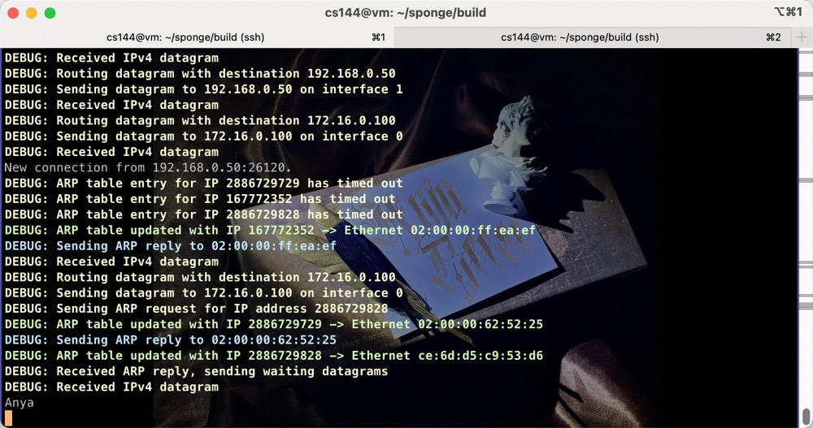
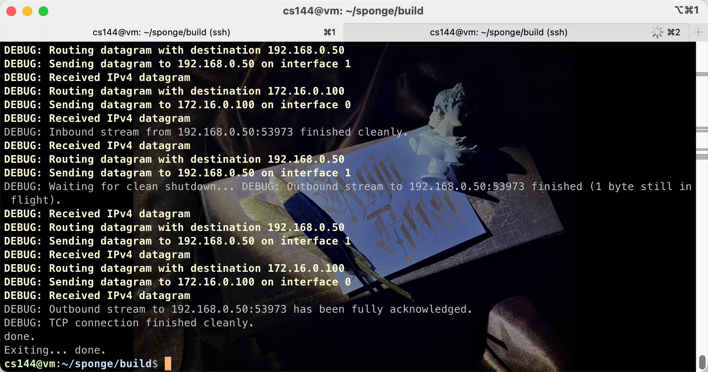
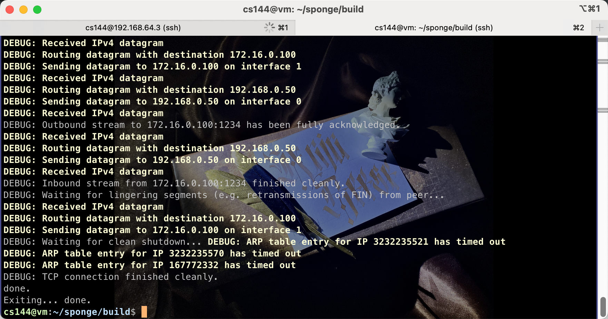

# Lab5: the summit (TCP in full)

> 3220103784 林子昕

## 一、实验背景  
- 学习掌握 TCP 的工作原理  

## 二、实验目的  
- 学习掌握 TCP 的工作原理  
- 学习掌握 TCP connection 的相关知识  
- 学习掌握协议栈结构  

## 三、实验内容  
- 将 TCPSender 和 TCPReceiver 结合，实现一个 TCP 终端，同时收发数据。  
- 实现 TCP connection 的状态管理，如连接和断开连接等。  
- 整合网络接口、IP 路由以及 TCP 并实现端到端的通信。  

## 四、主要仪器设备  
- 联网的 PC 机  
- Linux 虚拟机  

## 五、操作方法与实验步骤  
在开始整合代码之前，你需要了解以下 TCPConnection 的准则：  

1. **接收端**，TCPConnection 的 `segment_received()` 方法被调用时，它从网络中接收 TCPSegment。当这种情况发生时，TCPConnection 将查看 segment 并且：  
   - 如果设置了 RST 标志，将入站流和出站流都设置为错误状态，并永久终止连接。  
   - 把这个段交给 TCPReceiver，这样它就可以在传入的段上检查它关心的字段：seqno、SYN、负载以及 FIN。  
   - 如果设置了 ACK 标志，则告诉 TCPSender 它关心的传入段的字段：ackno 和 window_size。  
   - 如果传入的段包含一个有效的序列号，TCPConnection 确保至少有一个段作为应答被发送，以反映 ackno 和 window_size 的更新。  
   - 有一个特殊情况，你将不得不在 TCPConnection 的 `segment_received()` 方法中处理：响应一个 "keep-alive" 段。对方可能会选择发送一个带有无效序列号的段，以查看你的 TCP 是否仍然有效，你的 TCPConnection 应该回复这些 "keep-alive" 段。实现的代码如下：  
     ```cpp
     if (_receiver.ackno().has_value() and (seg.length_in_sequence_space() == 0) and seg.header().seqno == _receiver.ackno().value() - 1) 
     { 
         _sender.send_empty_segment();
     }
     ```

2. **发送端**，TCPConnection 将通过网络发送 TCPSegment：  
   - TCPSender 通过调用 `tcp_sender.cc` 中的函数，将一个 TCPSegment 数据包添加到待发送队列中，并设置一些字段（seqno，SYN，FIN）。  
   - 在发送当前数据包之前，TCPConnection 会获取当前它自己的 TCPReceiver 的 ackno 和 window size，将其放置进待发送 TCPSegment 中（设置 window_size 和 ackno），并设置其 ACK 标志。  

3. **tick**，当时间流逝，TCPConnection 有一个 `tick()` 方法，该方法将被操作系统定期调用，当这种情况发生时，TCPConnection 需要：  
   - 告诉 TCPSender 时间的流逝。  
   - 如果连续重传的次数超过上限 `TCPConfig::MAX_RETX_ATTEMPTS`，则终止连接，并发送一个重置段给对端（设置了 RST 标志的空段）。  
   - 如有必要，结束连接。  

## 六、实验数据记录和处理  
以下实验记录均需结合屏幕截图（截取源代码或运行结果），进行文字标注。  

- 实现 TCPConnection 的关键代码截图  

1. 在头文件中声明两个函数，分别用于设置 TCP 连接为 RST 状态和将待发送的 TCP 段添加到输出队列中，并在源文件中实现这两个函数。  

- `set_rst_state` 函数的实现。  
   - 如果 `send_rst` 为真，则创建一个带有 RST 标志的 TCP 段，并将其添加到输出队列中。
   - 将接收器的输出流和发送器的输入流设置为错误状态。
   - 将连接终止后的等待时间设置为 false。
   - 将连接状态设置为非活动状态。
- `flush_segments_with_ack` 函数的实现。  
   - 遍历发送器的输出队列中的所有 TCP 段。
   - 如果接收器有一个有效的 ACK 号，则设置 ACK 标志、确认号和窗口大小。
   - 将 TCP 段添加到输出队列中。

```cpp
void TCPConnection::set_rst_state(const bool send_rst) {
    if (send_rst) {
        TCPSegment rst;
        rst.header().rst = true;
        _segments_out.push(rst);
    }
    _receiver.stream_out().set_error();
    _sender.stream_in().set_error();
    _linger_after_streams_finish = false;
    _is_active = false;
}

void TCPConnection::flush_segments_with_ack() {
    // traverse all segments in the sender's queue
    while (!_sender.segments_out().empty()) {
        TCPSegment outgoing_segment = std::move(_sender.segments_out().front());
        _sender.segments_out().pop();

        // If the receiver has a valid ACK number, set the ACK flag, acknowledgment number, and window size in the segment header
        auto ack_number = _receiver.ackno(); 
        if (ack_number.has_value()) {
            outgoing_segment.header().ack = true;
            outgoing_segment.header().ackno = ack_number.value();
            outgoing_segment.header().win = _receiver.window_size();
        }

        _segments_out.push(outgoing_segment);
    }
}
```

2. TCPConnection 析构函数的实现。直接调用 `set_rst_state()` 函数即可。

```diff
TCPConnection::~TCPConnection() {
    try {
        if (active()) {
            cerr << "Warning: Unclean shutdown of TCPConnection\n";

            // Your code here: need to send a RST segment to the peer
+           set_rst_state(false);
        }
    } catch (const exception &e) {
        std::cerr << "Exception destructing TCP FSM: " << e.what() << std::endl;
    }
}
```

3. 完整的 TCPConnection 的 `segment_received()` 函数的实现。添加了对 RST 以及对 ACK 段的处理。
   - 如果是 RST 段，则关闭连接。
   - 如果是 ACK 段，则更新发送器的状态。
   - 最后，调用 `flush_segments_with_ack()` 函数，将待发送的 TCP 段添加到输出队列中。

```cpp
void TCPConnection::segment_received(const TCPSegment &seg) {
    _time_since_last_segment_received_ms = 0;
    _receiver.segment_received(seg);
    bool need_send_ack = seg.length_in_sequence_space();
    
    // If is RST, then close the connection
    if (seg.header().rst) {
        set_rst_state(false);
        return;
    }

    // Process ACK segments, update the sender's state
    if (seg.header().ack) {
        _sender.ack_received(seg.header().ackno, seg.header().win);

        // If acknowledgment is needed but new segments are already queued, no need to send an empty ACK
        const bool sender_has_data_to_send = !_sender.segments_out().empty();
        if (need_send_ack && sender_has_data_to_send) {
            need_send_ack = false;
        }
    }

    // 如果是 LISEN 到了 SYN
    if (TCPState::state_summary(_receiver) == TCPReceiverStateSummary::SYN_RECV &&
       TCPState::state_summary(_sender) == TCPSenderStateSummary::CLOSED) {
       connect();
       _is_active = true; // 在这里添加了一条修改 _is_active 为 true 的语句
       return;
    }
    ... // 省略框架代码，对 SYN、FIN 等字段的处理
   
    flush_segments_with_ack();
}
```

4. 完整的 TCPConnection 的 `tick()` 函数的实现。  
   - 调用发送器的 `tick()` 方法，更新发送器的状态。
   - 检查连续重传次数是否超过上限，如果是则终止连接。
   - 调用 `flush_segments_with_ack()` 函数，将待发送的 TCP 段添加到输出队列中。
   - 更新距离上一个接收到的段的时间。
   - 检查连接是否在 TIME_WAIT 状态下关闭。
     - 如果接收器和发送器都已关闭，且在 TIME_WAIT 状态下等待时间超过 10 倍的 RTT，则关闭连接。

```cpp
//! \param[in] ms_since_last_tick number of milliseconds since the last call to this method
void TCPConnection::tick(const size_t ms_since_last_tick) {
    _sender.tick(ms_since_last_tick);

    // Check retransmission limit and reset connection if exceeded
    if (_sender.consecutive_retransmissions() > _cfg.MAX_RETX_ATTEMPTS) {
        // Clear any pending retransmissions before resetting
        if (!_sender.segments_out().empty()) {
            _sender.segments_out().pop();
        }
        set_rst_state(true);  // Reset connection
        return;
    }

    flush_segments_with_ack();
    _time_since_last_segment_received_ms += ms_since_last_tick;

    // Check for connection closure in TIME_WAIT state
    const bool receiver_closed = TCPState::state_summary(_receiver) == TCPReceiverStateSummary::FIN_RECV;
    const bool sender_closed = TCPState::state_summary(_sender) == TCPSenderStateSummary::FIN_ACKED;
    const bool time_wait_expired = _time_since_last_segment_received_ms >= 10 * _cfg.rt_timeout;
    if (receiver_closed && sender_closed && _linger_after_streams_finish && time_wait_expired) {
        _is_active = false;               // Mark the connection as inactive
        _linger_after_streams_finish = false;  // Disable lingering
    }
}
```

5. 完整的 TCPConnection 的 `end_input_stream()` 和 `connect()` 函数的实现。  
   - `end_input_stream()` 函数用于关闭输出流。
   - `connect()` 函数用于建立连接，发送 SYN 段。

```cpp
//! End the outbound stream
void TCPConnection::end_input_stream() {
    _sender.stream_in().end_input(); // Close the outbound stream
    _sender.fill_window();
    flush_segments_with_ack();
}

//! Initiate connection by sending SYN
void TCPConnection::connect() {
    _sender.fill_window(); // Sends the initial SYN segment
    flush_segments_with_ack();
}
```

6. 其他函数

```cpp
size_t TCPConnection::remaining_outbound_capacity() const {
    return _sender.stream_in().remaining_capacity();
}

size_t TCPConnection::bytes_in_flight() const {
    return _sender.bytes_in_flight();
}

size_t TCPConnection::unassembled_bytes() const {
    return _receiver.unassembled_bytes();
}

size_t TCPConnection::time_since_last_segment_received() const {
    return _time_since_last_segment_received_ms;
}
```

- 运行 `make check` 命令的运行结果截图  



- 重新编写 `webget.cc` 的代码截图  

```diff
void get_URL(const string &host, const string &path) {
-   TCPSocket sock;
+   FullStackSocket sock;
    sock.connect(Address(host, "http"));

    sock.write("GET " + path + " HTTP/1.1\r\n");
    sock.write("Host: " + host + "\r\n");
    sock.write("Connection: close\r\n");
    sock.write("\r\n");

    while (!sock.eof()) {
        cout << sock.read();
    }

    sock.close();
+   sock.wait_until_closed();
}
```

- 重新测试 webget 的测试结果展示  




- 最终测试中服务器的运行截图，最终测试中客户端的运行截图，【选做】在成功连接后端到端发送消息的运行截图，【选做】成功关闭连接的截图  



> 发送端



> 接收端





> 关闭连接

## 七、实验数据记录和处理  
根据你编写的程序运行效果，分别解答以下问题：  

- ACK 标志的目的是什么？ackno 是经常存在的吗？  
   > ACK（Acknowledgment）标志用于通知发送方，接收方已经成功接收了数据包，并表明下一次期望接收的字节序列号。这有助于实现 TCP 的可靠传输，通过确认机制保证数据不会丢失或重复传输。发送方可以通过接收的 ACK 确认号来判断哪些数据已经成功被接收，从而更新发送窗口，确保数据流的连续性。
   > ackno 是经常存在的。在 TCP 连接中，几乎所有有效数据包都会携带 ACK 标志和确认号。只有在建立连接时发送的 SYN 数据包（不携带有效数据）或在关闭连接时的某些 FIN 数据包中，ackno 可能会被设置为无效。

- 请描述 TCPConnection 的代码中是如何整合 TCPReceiver 和 TCPSender 的。  
   > 在 `TCPConnection` 中，`segment_received` 负责调用 `_receiver.segment_received` 处理接收的数据段，并根据段的标志位更新状态，如果是 ACK 段，则调用 `_sender.ack_received` 更新发送端的确认号和窗口大小；如果需要回应空 ACK，则调用 `_sender.send_empty_segment` 发送空段。
   `flush_segments_with_ack` 遍历 `_sender` 中的待发送段，将 `ackno` 和 `window_size` 信息添加到段头部，然后推送到 `_segments_out` 以便传输。`write` 方法调用 `_sender.stream_in().write` 写入数据，并调用 `connect` 触发发送操作。`tick` 方法通过 `_sender.tick` 处理定时器逻辑，如重传和超时，当重传次数超过上限时调用 `set_rst_state` 重置连接。
   `end_input_stream` 方法标记发送流结束，并通过 `flush_segments_with_ack` 发送剩余数据。析构函数在连接未完全关闭时调用 `set_rst_state` 发送 RST 段，确保连接终止。
   整个 `TCPConnection` 通过 `TCPReceiver` 负责接收数据流和状态管理，`TCPSender` 负责发送数据包和重传逻辑，并通过 ACK 和窗口同步接收端与发送端的状态，协调实现完整的 TCP 功能。

- 【选做】在最终测试中服务器和客户端能互连吗？如果不能，你分析是什么原因？  
   > 可以互连

- 【选做】在关闭连接的时候是否两端都能正常关闭？如果不能，你分析是原因？  
   > 都可以正常关闭

## 八、实验数据记录和处理  
实验过程中遇到的困难，得到的经验教训，对本实验安排的更好建议。  
